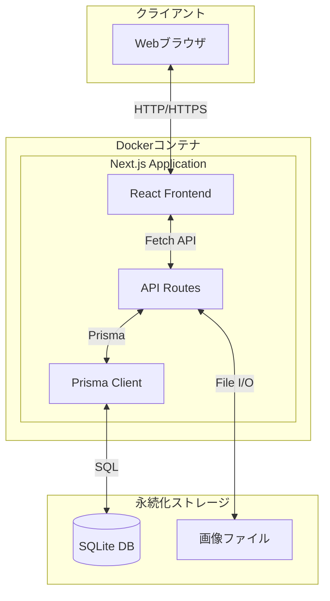

# アーキテクチャ設計書

## 概要

Coffee Tasting Journalのシステムアーキテクチャを定義します。

## システム構成



## 技術スタック

| レイヤー | 技術 | 説明 |
|----------|------|------|
| フロントエンド | Next.js (App Router) | React ベースのフルスタックフレームワーク |
| 言語 | TypeScript | 型安全な JavaScript |
| スタイリング | Tailwind CSS | ユーティリティファーストCSS |
| API | Next.js API Routes | サーバーサイドAPI |
| ORM | Prisma | 型安全なデータベースアクセス |
| データベース | SQLite | 軽量な組み込みDB |
| コンテナ | Docker | アプリケーションのコンテナ化 |

## ディレクトリ構造

```
coffee-tasting-journal/
├── .github/
│   └── copilot-instructions.md  # Copilot用指示書
├── docs/                         # ドキュメント
│   ├── architecture.md           # アーキテクチャ設計書
│   ├── data-model.md             # データモデル設計書
│   └── state-diagram.md          # 状態遷移図
├── prisma/
│   ├── schema.prisma             # Prismaスキーマ
│   └── migrations/               # マイグレーションファイル
├── src/
│   ├── app/                      # Next.js App Router
│   │   ├── layout.tsx            # ルートレイアウト
│   │   ├── page.tsx              # ホームページ
│   │   ├── api/                  # API Routes
│   │   │   ├── shops/
│   │   │   ├── drippers/
│   │   │   ├── filters/
│   │   │   ├── beans/
│   │   │   └── tastings/
│   │   ├── shops/                # 店舗管理ページ
│   │   ├── drippers/             # ドリッパー管理ページ
│   │   ├── filters/              # フィルター管理ページ
│   │   ├── beans/                # 豆管理ページ
│   │   └── tastings/             # 試飲記録ページ
│   ├── components/               # Reactコンポーネント
│   │   ├── ui/                   # 汎用UIコンポーネント
│   │   ├── forms/                # フォームコンポーネント
│   │   └── layouts/              # レイアウトコンポーネント
│   ├── lib/                      # ユーティリティ
│   │   ├── prisma.ts             # Prisma Client
│   │   ├── constants.ts          # 定数定義
│   │   └── utils.ts              # ユーティリティ関数
│   └── types/                    # 型定義
│       └── index.ts
├── public/                       # 静的ファイル
├── data/                         # データ永続化（Dockerボリューム）
│   ├── database.db               # SQLiteデータベース
│   └── images/                   # アップロード画像
│       ├── beans/
│       ├── drippers/
│       ├── filters/
│       └── tastings/
├── Dockerfile
├── docker-compose.yml
├── package.json
├── tsconfig.json
└── tailwind.config.ts
```

## API設計

### エンドポイント一覧

| メソッド | パス | 説明 |
|----------|------|------|
| GET | /api/shops | 店舗一覧取得 |
| POST | /api/shops | 店舗登録 |
| GET | /api/shops/[id] | 店舗詳細取得 |
| PUT | /api/shops/[id] | 店舗更新 |
| DELETE | /api/shops/[id] | 店舗削除 |
| GET | /api/drippers | ドリッパー一覧取得 |
| POST | /api/drippers | ドリッパー登録 |
| GET | /api/drippers/[id] | ドリッパー詳細取得 |
| PUT | /api/drippers/[id] | ドリッパー更新 |
| DELETE | /api/drippers/[id] | ドリッパー削除 |
| GET | /api/filters | フィルター一覧取得 |
| POST | /api/filters | フィルター登録 |
| GET | /api/filters/[id] | フィルター詳細取得 |
| PUT | /api/filters/[id] | フィルター更新 |
| DELETE | /api/filters/[id] | フィルター削除 |
| GET | /api/beans | 豆一覧取得 |
| POST | /api/beans | 豆登録 |
| GET | /api/beans/[id] | 豆詳細取得 |
| PUT | /api/beans/[id] | 豆更新 |
| DELETE | /api/beans/[id] | 豆削除 |
| PATCH | /api/beans/[id]/status | 豆ステータス変更 |
| GET | /api/beans/origins | 産地一覧取得（オートコンプリート用） |
| GET | /api/tastings | 試飲記録一覧取得 |
| POST | /api/tastings | 試飲記録登録 |
| GET | /api/tastings/[id] | 試飲記録詳細取得 |
| PUT | /api/tastings/[id] | 試飲記録更新 |
| DELETE | /api/tastings/[id] | 試飲記録削除 |
| POST | /api/upload | 画像アップロード |

### レスポンス形式

```typescript
// 成功時
{
  "success": true,
  "data": { ... }
}

// エラー時
{
  "success": false,
  "error": {
    "code": "VALIDATION_ERROR",
    "message": "銘柄は必須です"
  }
}

// 一覧取得時
{
  "success": true,
  "data": [...],
  "pagination": {
    "total": 100,
    "page": 1,
    "limit": 20,
    "totalPages": 5
  }
}
```

## Docker構成

### Dockerfile

```dockerfile
FROM node:20-alpine AS base

# 依存関係インストール
FROM base AS deps
WORKDIR /app
COPY package*.json ./
RUN npm ci

# ビルド
FROM base AS builder
WORKDIR /app
COPY --from=deps /app/node_modules ./node_modules
COPY . .
RUN npx prisma generate
RUN npm run build

# 本番
FROM base AS runner
WORKDIR /app
ENV NODE_ENV=production

COPY --from=builder /app/public ./public
COPY --from=builder /app/.next/standalone ./
COPY --from=builder /app/.next/static ./.next/static
COPY --from=builder /app/prisma ./prisma
COPY --from=builder /app/node_modules/.prisma ./node_modules/.prisma

# データディレクトリ作成
RUN mkdir -p /app/data/images/beans
RUN mkdir -p /app/data/images/drippers
RUN mkdir -p /app/data/images/filters
RUN mkdir -p /app/data/images/tastings

EXPOSE 3000
ENV PORT=3000
ENV HOSTNAME="0.0.0.0"

CMD ["node", "server.js"]
```

### docker-compose.yml

```yaml
version: '3.8'

services:
  app:
    build: .
    ports:
      - "3000:3000"
    environment:
      - DATABASE_URL=file:/app/data/database.db
    volumes:
      - ./data:/app/data
    restart: unless-stopped
```

## セキュリティ考慮事項

### 入力バリデーション

- すべてのユーザー入力はサーバーサイドでバリデーション
- SQLインジェクション対策（Prismaの利用）
- XSS対策（Reactの自動エスケープ）

### ファイルアップロード

- 許可する拡張子: .jpg, .jpeg, .png, .gif, .webp
- 最大ファイルサイズ: 5MB
- ファイル名はUUIDで生成（衝突防止）

### 家庭内利用の前提

- 認証機能は初期実装では省略
- 将来的に必要であれば追加可能

## パフォーマンス最適化

### データベース

- 適切なインデックスの設定
- ページネーションの実装
- 必要なカラムのみ取得（select指定）

### フロントエンド

- Next.js Image コンポーネントによる画像最適化
- コンポーネントの遅延読み込み
- React Server Components の活用

### キャッシュ

- 静的アセットのキャッシュ
- APIレスポンスの適切なキャッシュヘッダー設定
