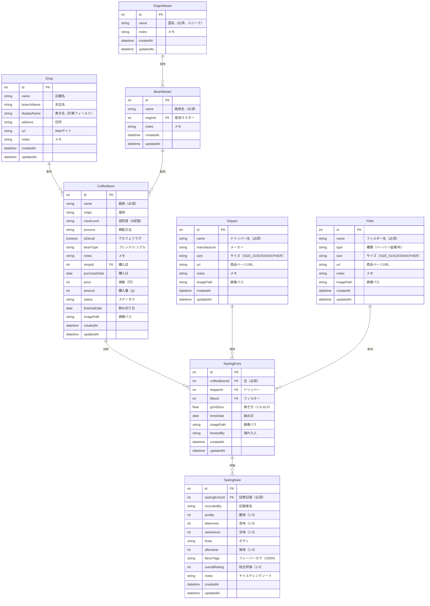

# データモデル設計書

## 概要

Coffee Tasting Journalのデータモデル設計書です。
自宅でハンドドリップしたコーヒーの試飲記録を管理するためのデータ構造を定義します。

## エンティティ関連図 (ER図)

## エンティティ詳細

### 1. Shop（店舗マスター）

購入店の情報を管理します。

| フィールド  | 型       | 必須 | 説明                                             |
| ----------- | -------- | ---- | ------------------------------------------------ |
| id          | Int      | ○    | 主キー（自動採番）                               |
| name        | String   | ○    | 店舗名（例: やなか珈琲）                         |
| branchName  | String   | -    | 支店名（例: 谷中店）                             |
| displayName | -        | -    | 計算フィールド: "name branchName" またはnameのみ |
| address     | String   | -    | 住所                                             |
| url         | String   | -    | WebサイトURL                                     |
| notes       | String   | -    | メモ（営業時間など）                             |
| createdAt   | DateTime | ○    | 作成日時                                         |
| updatedAt   | DateTime | ○    | 更新日時                                         |

**displayNameの生成ルール:**

- nameとbranchNameの両方がある場合: `"{name} {branchName}"` （例: "やなか珈琲 谷中店"）
- nameのみの場合: `"{name}"` （例: "地元の珈琲屋"）

### 2. Dripper（ドリッパーマスター）

使用するドリッパーを管理します。

| フィールド   | 型       | 必須 | 説明                             |
| ------------ | -------- | ---- | -------------------------------- |
| id           | Int      | ○    | 主キー（自動採番）               |
| name         | String   | ○    | ドリッパー名                     |
| manufacturer | String   | -    | メーカー名                       |
| size         | Enum     | -    | サイズ（SIZE_01/02/03/04/OTHER） |
| url          | String   | -    | 商品ページURL                    |
| notes        | String   | -    | メモ                             |
| imagePath    | String   | -    | 画像ファイルパス                 |
| createdAt    | DateTime | ○    | 作成日時                         |
| updatedAt    | DateTime | ○    | 更新日時                         |

### 3. Filter（フィルターマスター）

使用するフィルターを管理します。

| フィールド | 型       | 必須 | 説明                             |
| ---------- | -------- | ---- | -------------------------------- |
| id         | Int      | ○    | 主キー（自動採番）               |
| name       | String   | ○    | フィルター名                     |
| type       | String   | -    | 種類（PAPER/METAL/CLOTH）        |
| size       | Enum     | -    | サイズ（SIZE_01/02/03/04/OTHER） |
| url        | String   | -    | 商品ページURL                    |
| notes      | String   | -    | メモ                             |
| imagePath  | String   | -    | 画像ファイルパス                 |
| createdAt  | DateTime | ○    | 作成日時                         |
| updatedAt  | DateTime | ○    | 更新日時                         |

#### サイズ（EquipmentSize）の値

ドリッパーとフィルターで共通のサイズ分類です。

| 値      | 表示名        | 説明             |
| ------- | ------------- | ---------------- |
| SIZE_01 | 01（1-2杯用） | 小サイズ         |
| SIZE_02 | 02（1-4杯用） | 標準サイズ       |
| SIZE_03 | 03（3-6杯用） | 中〜大サイズ     |
| SIZE_04 | 04（4-8杯用） | 大サイズ         |
| OTHER   | その他        | 上記に該当しない |

### 4. CoffeeBean（コーヒー豆マスター）

購入した豆の情報を管理します。同じ銘柄でも購入ごとに別レコードとして管理します。

| フィールド   | 型       | 必須 | 説明                                |
| ------------ | -------- | ---- | ----------------------------------- |
| id           | Int      | ○    | 主キー（自動採番）                  |
| name         | String   | ○    | 銘柄（商品名・農園名）              |
| origin       | String   | -    | 産地                                |
| roastLevel   | String   | -    | 焙煎度（8段階）                     |
| process      | String   | -    | 精製方法                            |
| isDecaf      | Boolean  | ○    | デカフェフラグ（デフォルト: false） |
| beanType     | String   | -    | ブレンド/シングルオリジン           |
| notes        | String   | -    | メモ（パッケージ説明など）          |
| shopId       | Int      | -    | 購入店（外部キー）                  |
| purchaseDate | Date     | -    | 購入日                              |
| price        | Int      | -    | 価格（円）                          |
| amount       | Int      | -    | 購入量（g）                         |
| status       | String   | ○    | ステータス（デフォルト: IN_STOCK）  |
| finishedDate | Date     | -    | 飲み切り日                          |
| imagePath    | String   | -    | 画像ファイルパス                    |
| createdAt    | DateTime | ○    | 作成日時                            |
| updatedAt    | DateTime | ○    | 更新日時                            |

#### 焙煎度（RoastLevel）の値

| 値        | 表示名                       | 5段階マッピング |
| --------- | ---------------------------- | --------------- |
| LIGHT     | ライトロースト               | 浅煎り          |
| CINNAMON  | シナモンロースト             | 浅煎り          |
| MEDIUM    | ミディアムロースト           | 中浅煎り        |
| HIGH      | ハイロースト・ダークロースト | 中煎り          |
| CITY      | シティロースト               | 中煎り          |
| FULL_CITY | フルシティロースト           | 中深煎り        |
| FRENCH    | フレンチロースト             | 深煎り          |
| ITALIAN   | イタリアンロースト           | 深煎り          |

#### 精製方法（Process）の値

| 値             | 表示名             |
| -------------- | ------------------ |
| WASHED         | ウォッシュド       |
| NATURAL        | ナチュラル         |
| HONEY          | ハニー             |
| PULPED_NATURAL | パルプドナチュラル |
| SEMI_WASHED    | セミウォッシュド   |

#### 豆タイプ（BeanType）の値

| 値            | 表示名           |
| ------------- | ---------------- |
| SINGLE_ORIGIN | シングルオリジン |
| BLEND         | ブレンド         |

#### ステータス（Status）の値

| 値       | 表示名   |
| -------- | -------- |
| IN_STOCK | 在庫中   |
| FINISHED | 飲み切り |

### 5. TastingEntry（ドリップ記録）

実際にコーヒーを淹れた抽出記録を管理します。評価情報はTastingNoteで管理します。

| フィールド   | 型       | 必須 | 説明                        |
| ------------ | -------- | ---- | --------------------------- |
| id           | Int      | ○    | 主キー（自動採番）          |
| coffeeBeanId | Int      | ○    | 豆（外部キー）              |
| dripperId    | Int      | -    | ドリッパー（外部キー）      |
| filterId     | Int      | -    | フィルター（外部キー）      |
| grindSize    | Float    | -    | 挽き方（1.0-10.0、0.5刻み） |
| brewDate     | Date     | ○    | 抽出日                      |
| imagePath    | String   | -    | 画像ファイルパス            |
| brewedBy     | String   | -    | 淹れた人                    |
| createdAt    | DateTime | ○    | 作成日時                    |
| updatedAt    | DateTime | ○    | 更新日時                    |

## インデックス

パフォーマンス最適化のためのインデックス：

| テーブル     | カラム         | 用途                       |
| ------------ | -------------- | -------------------------- |
| CoffeeBean   | status         | 在庫中の豆のフィルタリング |
| CoffeeBean   | shopId         | 店舗別の豆一覧             |
| CoffeeBean   | origin         | 産地でのフィルタリング     |
| CoffeeBean   | roastLevel     | 焙煎度でのフィルタリング   |
| TastingEntry | coffeeBeanId   | 豆ごとの試飲記録一覧       |
| TastingEntry | brewDate       | 日付順の並び替え           |
| TastingNote  | tastingEntryId | 試飲記録ごとのノート一覧   |

---

### 6. TastingNote（テイスティングノート）

1つの試飲記録（TastingEntry）に対して、複数人がテイスティングノートを追加できる機能です。
同じコーヒーを複数人で試飲し、それぞれの感想を記録する際に使用します。

| フィールド     | 型       | 必須 | 説明                       |
| -------------- | -------- | ---- | -------------------------- |
| id             | Int      | ○    | 主キー（自動採番）         |
| tastingEntryId | Int      | ○    | 試飲記録ID（外部キー）     |
| recordedBy     | String   | -    | 記録者名                   |
| acidity        | Int      | -    | 酸味（1-5）                |
| bitterness     | Int      | -    | 苦味（1-5）                |
| sweetness      | Int      | -    | 甘味（1-5）                |
| body           | Body     | -    | ボディ（軽い/中程度/重い） |
| aftertaste     | Int      | -    | 後味（1-5）                |
| flavorTags     | String   | -    | フレーバータグ（JSON配列） |
| overallRating  | Int      | -    | 総合評価（1-5）            |
| notes          | String   | -    | テイスティングノート       |
| createdAt      | DateTime | ○    | 作成日時                   |
| updatedAt      | DateTime | ○    | 更新日時                   |

#### リレーション

- **TastingEntry** → **TastingNote**: 1対多（1つの試飲記録に複数のノート）
- **カスケード削除**: 試飲記録を削除すると、関連するノートも自動削除

#### 用途・想定シーン

1. **複数人での試飲会**: 同じコーヒーを複数人で飲み、それぞれの感想を記録
2. **時間経過での再評価**: 同じ試飲記録に対して、時間を置いて再度評価を追加
3. **ゲストの感想記録**: 来客時に試飲してもらい、感想を記録

## 制約

### 外部キー制約

| 子テーブル                | 親テーブル    | 削除時の動作                         |
| ------------------------- | ------------- | ------------------------------------ |
| CoffeeBean.shopId         | Shop.id       | SET NULL（店舗削除時は参照をNULLに） |
| TastingEntry.coffeeBeanId | CoffeeBean.id | CASCADE（豆削除時は試飲記録も削除）  |
| TastingEntry.dripperId    | Dripper.id    | SET NULL                             |
| TastingEntry.filterId     | Filter.id     | SET NULL                             |

### バリデーション

- grindSize: 1.0 ～ 10.0（0.5刻み）
- acidity, bitterness, sweetness, aftertaste: 1 ～ 5
- overallRating: 1 ～ 5
- price, amount: 0以上の整数
