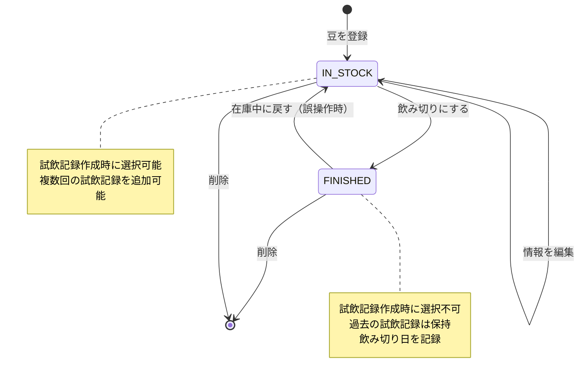
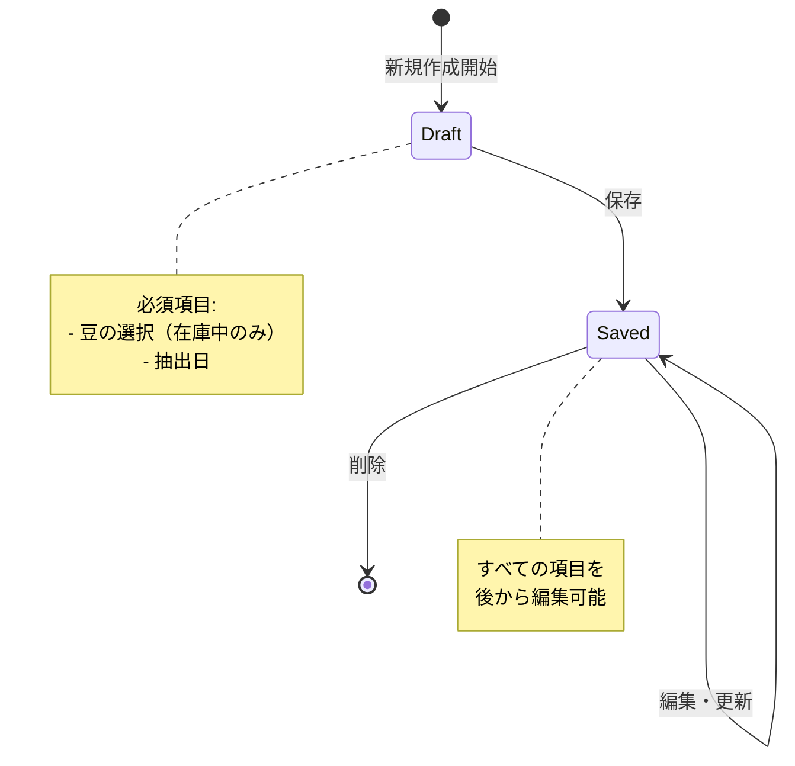
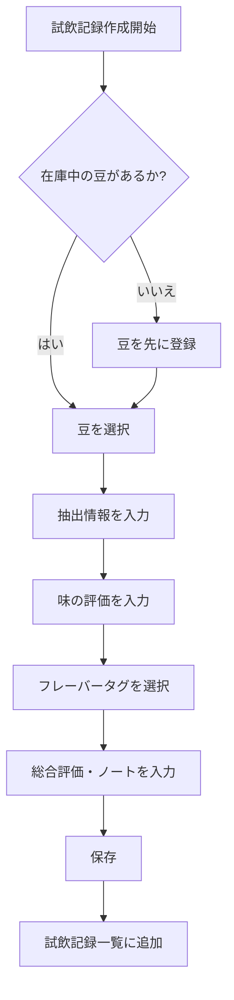
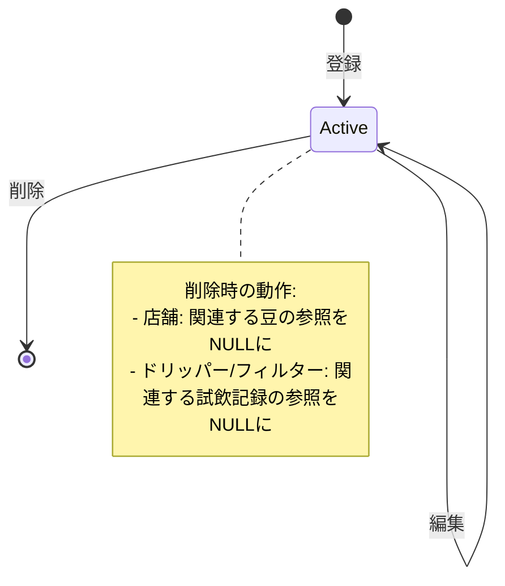
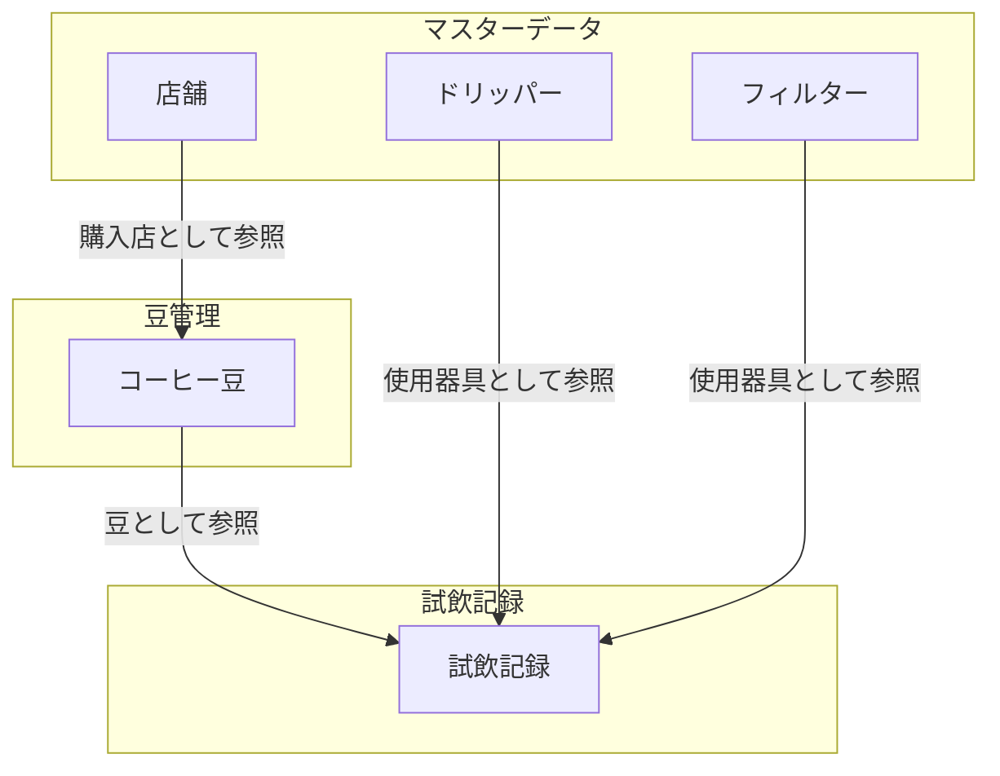
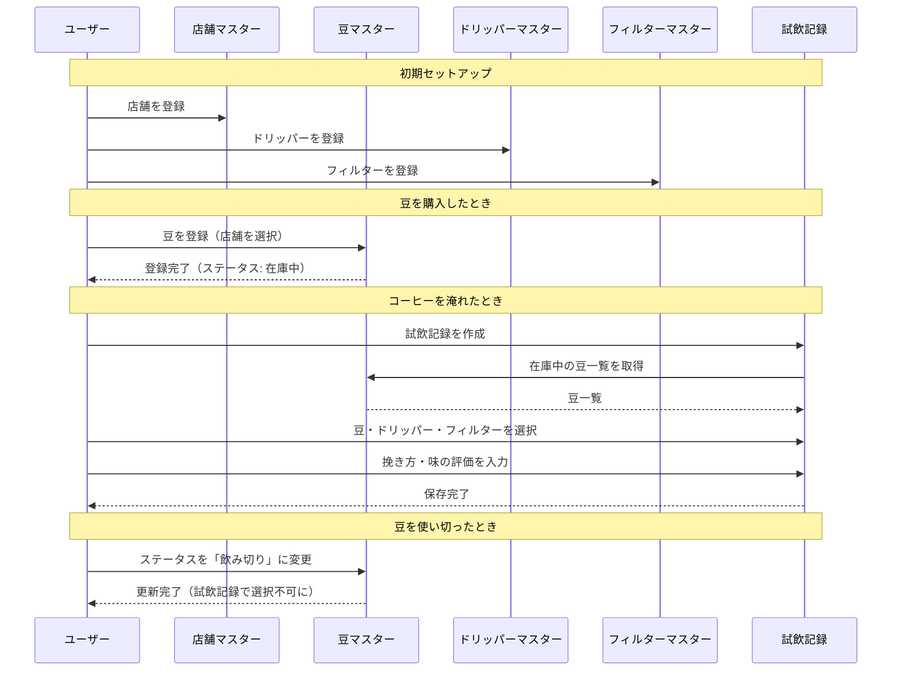
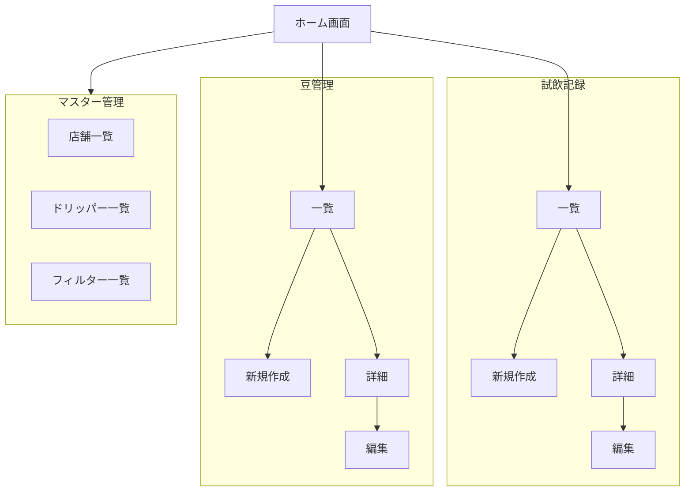
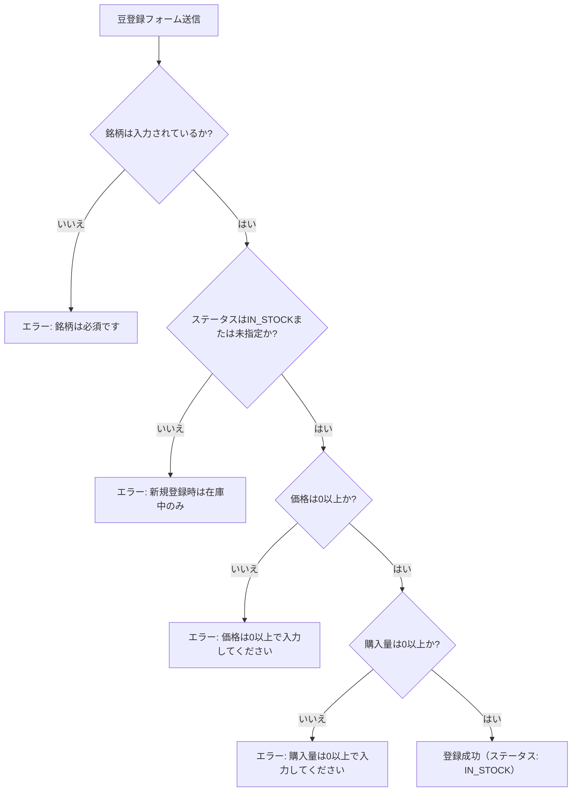
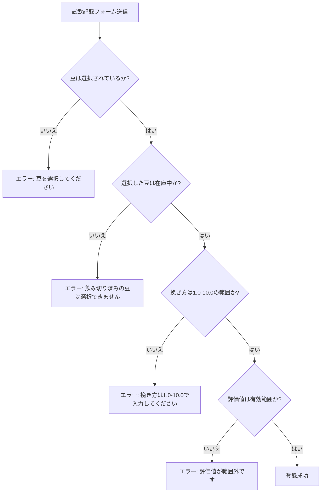

# 状態遷移図

## 概要

Coffee Tasting Journalにおける主要なエンティティの状態遷移を定義します。

## 1. コーヒー豆（CoffeeBean）の状態遷移

### 状態の説明

| 状態                 | 説明                             | 試飲記録での選択 |
| -------------------- | -------------------------------- | ---------------- |
| IN_STOCK（在庫中）   | 購入後、まだ飲み切っていない状態 | ✓ 選択可能       |
| FINISHED（飲み切り） | 豆を使い切った状態               | ✗ 選択不可       |

### 遷移イベント

| イベント       | 遷移前            | 遷移後   | 備考                                             |
| -------------- | ----------------- | -------- | ------------------------------------------------ |
| 豆を登録       | -                 | IN_STOCK | 新規登録時はIN_STOCKのみ（FINISHEDでの登録不可） |
| 飲み切りにする | IN_STOCK          | FINISHED | finishedDateを記録                               |
| 在庫中に戻す   | FINISHED          | IN_STOCK | finishedDateをクリア                             |
| 削除           | IN_STOCK/FINISHED | -        | 関連する試飲記録も削除                           |

### 重要な制約

- **新規登録時は「在庫中」のみ**: 豆は購入時に在庫中で登録し、後から「飲み切り」に変更するフローのみ
- **「飲み切り」での新規登録は不可**: 過去に飲み切った豆を過去日付で登録するようなフローは想定しない

## 2. 試飲記録（TastingEntry）のライフサイクル

### 試飲記録作成フロー

## 3. マスターデータの管理

### 店舗・ドリッパー・フィルターのライフサイクル

## 4. データフロー

### 全体のデータフロー

### 豆登録から試飲記録までの流れ

## 5. 画面遷移

## 6. バリデーションルール

### 豆登録時

### 試飲記録作成時

